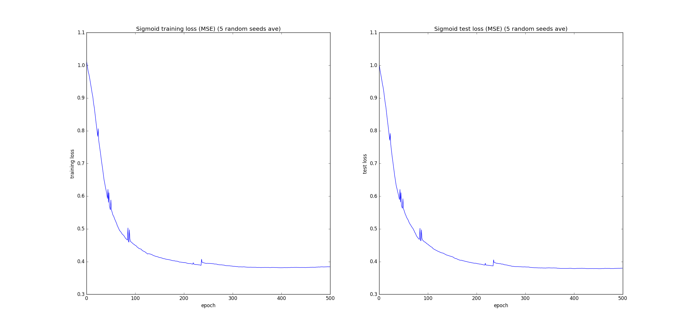
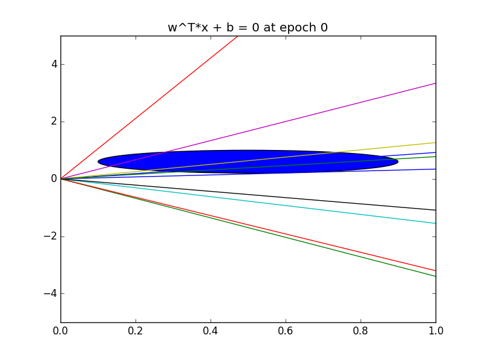
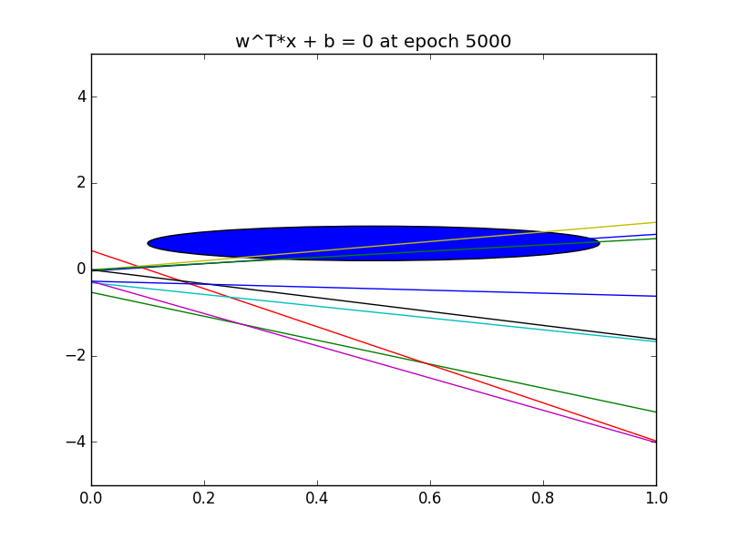
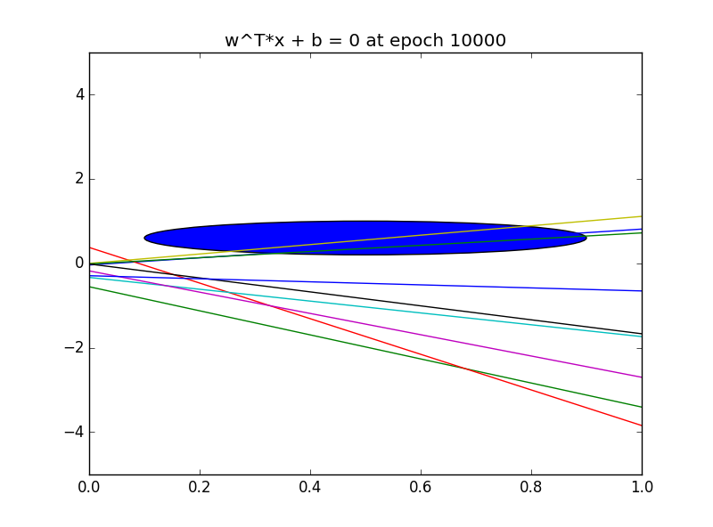

# CAP-6610 HW 2

By: Patrick Emami

## Perceptron Learning Algorithm

Run with `pla.py --model PLA --n_epochs 10`

On the [Bank Marketing Data Set](https://archive.ics.uci.edu/ml/datasets/Bank+Marketing), using 10% of the data, PLA achieves a 
classification error of `18.25662 %`, train MSE of `0.42282176`, and test MSE of `0.36513274`. Results
are averaged over 5 random seeds. 

The performance on the dataset is benchmarked by 2 methods. 

1. Always guessing the label 1.0 (No response) achieved `11.6371681416 %` classification error averaged across 5 random seeds.
2. Logistic Regression achieved `2.22123893805 %` classification error averaged across 5 random seeds.

## Single-node Neural Network

Run with `pla.py --model sigmoid --learning_rate 0.1 --n_epochs 500`

On the [Bank Marketing Data Set](https://archive.ics.uci.edu/ml/datasets/Bank+Marketing), using 10% of the data, 
the single-node neural net achieved a classification error of `18.99114 %`, train MSE of `0.384254754533`, and test MSE `0.37982300885`.
Results averaged over 5 random seeds.

## Multi-Layer Perceptron

3-layer MLP with two input units, ten hidden units, and one output unit.
Objective is to learn the concept of a circle in 2D space. A label of +1
is assigned if `(x - a)^2 + (y - b)^2 < r^2` and is labeled -1 otherwise.

All data is drawn from the unit square, and `a = 0.5`, `b = 0.6`, and `r = 0.4`.

Training data is 100 random samples uniformly distributed on the unit square,
and test data is 100 random samples drawn similarly.

Best results over running 5 different random seeds for 20,000 epochs 
was a test MSE of `0.06` and a classification error of `2 %`. 

Hyperplanes `\sum w_i x_i + b = 0` plotted at intervals:

## Recurrent Neural-Network

| Random Seed | y1 (MSE) | y2 (MSE) | w1 | w2 | w1_hat | w2_hat | bias1 | bias2
|---|---|---|---|---|---|---|---|---
| 23912 | 0.0008 | 0.0001 | -0.08824226 |  1.05798196 | 0.56187399 | -2.40338361 | 0.65013105 | -1.24926364
| 72938 | 0.0028 | 0.0049 | -4.03109385 | -0.90386201 | 1.6435506 | -2.49336755 | 1.31868148 | -0.46683088
| 9999 |  0.0008 | 0.0001 | -1.11172633 | -0.17362505 | 1.77607984 | -1.46465122 | 1.00974762 | -0.51267624
| 6767 |  0.0007 | 0.0002 | 1.41394524 | 0.46672458 | -1.39501531 | -1.31052867 | 0.15320471 | -0.83057737
| 1123 |  0.0009 | 0.0001 | 1.4844188 | -1.55841486 | -0.65509823 | -0.38466215 | 0.01454801 | 0.47195181

