# CAP-6610 HW 2

By: Patrick Emami

## Perceptron Learning Algorithm

Run with `pla.py --model PLA --n_epochs 10`

No need to specify the random seed in the arguments, since the 5 seeds are pre-specified 
within the code. 

On the [Bank Marketing Data Set](https://archive.ics.uci.edu/ml/datasets/Bank+Marketing), using 10% of the data, PLA achieves a 
classification error of `18.26 %`, train MSE of `0.42282176`, and test MSE of `0.36513274`. Results
are averaged over 5 random seeds and are shown for 10 epochs.  

The performance on the dataset is benchmarked by 2 methods. 

1. Always guessing the label 1.0 (No response) achieved `11.64 %` classification error averaged across 5 random seeds.
2. The `sklearn` Logistic Regression classifier with default parameters achieved `2.22 %` classification error averaged across 5 random seeds.

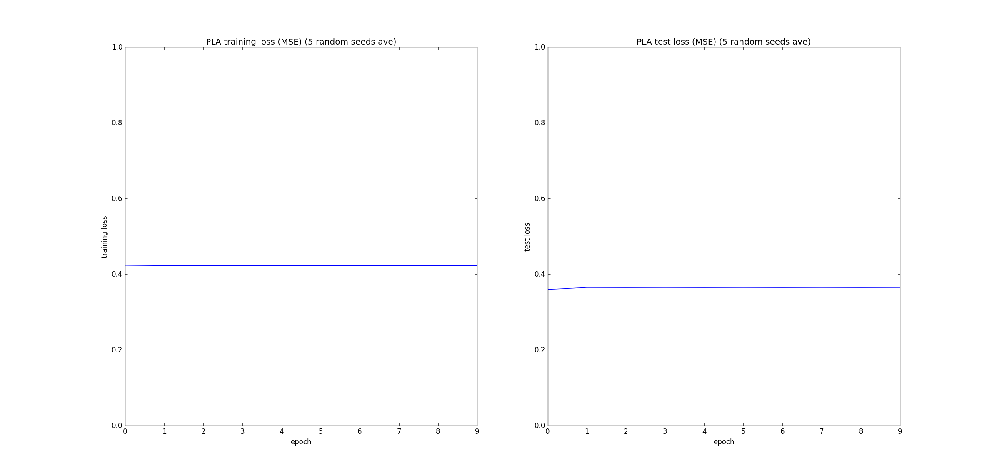
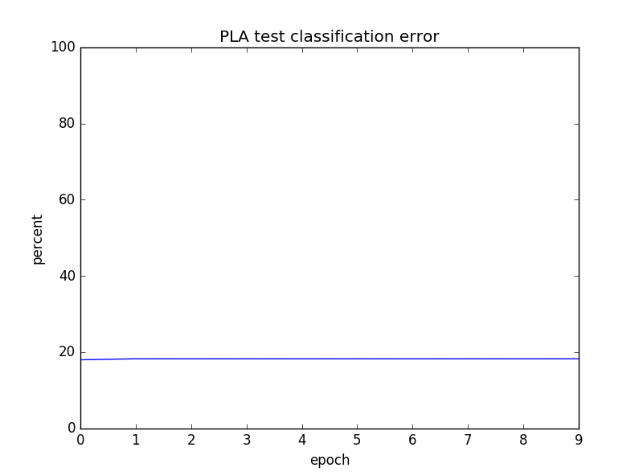

The data was not reshuffled between epochs; after one pass over the dataset, if the training data was re-sampled, the weights
completely changed.

## Single-node Neural Network

Run with `pla.py --model sigmoid --learning_rate 0.1 --n_epochs 500`

On the [Bank Marketing Data Set](https://archive.ics.uci.edu/ml/datasets/Bank+Marketing), using 10% of the data, 
the single-node neural net achieved a classification error of `18.99 %`, train MSE of `0.384254754533`, and test MSE `0.37982300885`.
Results averaged over 5 random seeds. No need to specify the random seed in the arguments, since the 5 seeds are pre-specified 
within the code. After a hyper-parameter search, a learning rate of `0.1` was selected. The weights were initially sampled from a standard normal distribution.

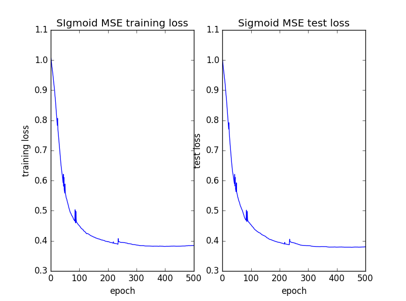
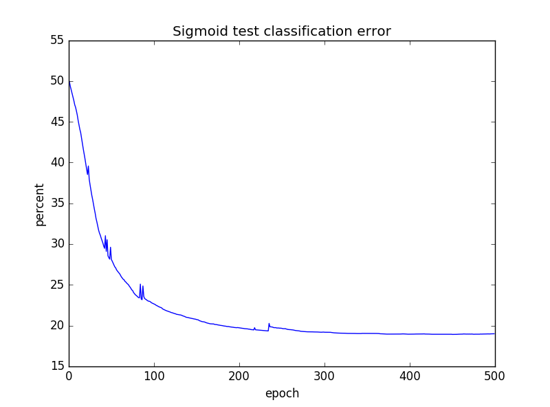

## Multi-Layer Perceptron

Run with `python mlp.py --random_seed 82727 --n_epochs 20000 --learning_rate 0.025`

3-layer MLP with two input units, ten hidden units, and one output unit.
Objective is to learn the concept of a circle in 2D space. A label of +1
is assigned if `(x - a)^2 + (y - b)^2 < r^2` and is labeled -1 otherwise.

All data is drawn from the unit square, and `a = 0.5`, `b = 0.6`, and `r = 0.4`.

Training data is 100 random samples uniformly distributed on the unit square,
and test data is 100 random samples drawn similarly.

Best results over running 5 different random seeds for 20,000 epochs 
was a test MSE of `0.06` and a classification error of `2.00 %`. 

After a hyper-parameter search over 5 different random seeds, the learning rate of `0.025` was selected.
Weights were initialized from a normal distribution with std dev of `2`.

After 20,000 epochs, the network was able to learn the concept of the circle:

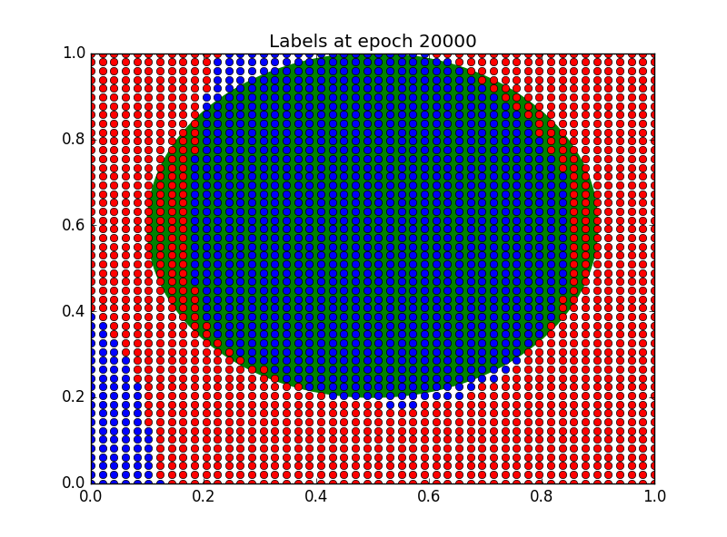
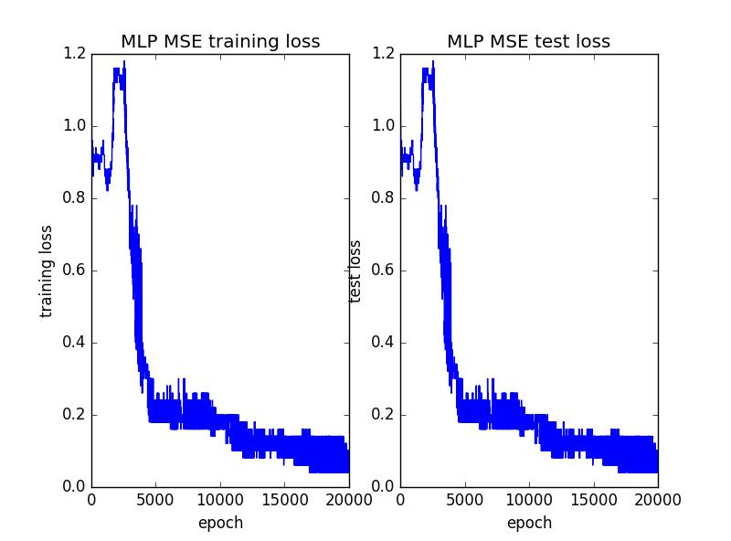
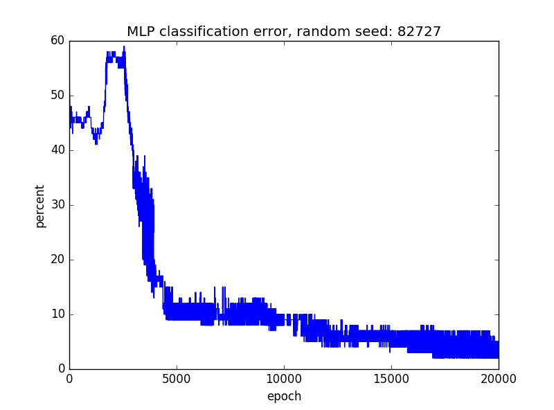

## Recurrent Neural-Network

Run with `python rnn.py --random_seed 1234 --learning_rate 0.1 --n_epochs 500`

Goal was to determine the weights for a simple RNN architecture that produced outputs `y1` and `y1` for 200 input pairs 
`x1` and `x2`. These are the results of running 5 experiments, each with a different random seed. After a hyper-parameter search, a learning rate of 
`0.1` was chosen for gradient descent. Weights were initialized from a normal distribution with a std dev of `3`. Each entry 
of the table shows the resulting weights after `500` epochs for a different random seed. The plots show the MSE of the 
training loss vs. epochs.

| Random Seed | y1 (MSE) | y2 (MSE)
|---|---|---|
| 23912 | 0.0008 | 0.0001 
| 72938 | 0.0028 | 0.0049 
| 9999 |  0.0008 | 0.0001 
| 6767 |  0.0007 | 0.0002 
| 1123 |  0.0009 | 0.0001 

 w1 | w2 | w1_hat | w2_hat | bias1 | bias2
 ---|---|---|---|---|---
 | -0.08824226 |  1.05798196 | 0.56187399 | -2.40338361 | 0.65013105 | -1.24926364
 | -4.03109385 | -0.90386201 | 1.6435506 | -2.49336755 | 1.31868148 | -0.46683088
 | -1.11172633 | -0.17362505 | 1.77607984 | -1.46465122 | 1.00974762 | -0.51267624
 | 1.41394524 | 0.46672458 | -1.39501531 | -1.31052867 | 0.15320471 | -0.83057737
 | 1.4844188 | -1.55841486 | -0.65509823 | -0.38466215 | 0.01454801 | 0.47195181
 
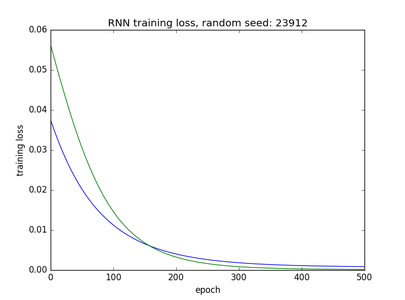
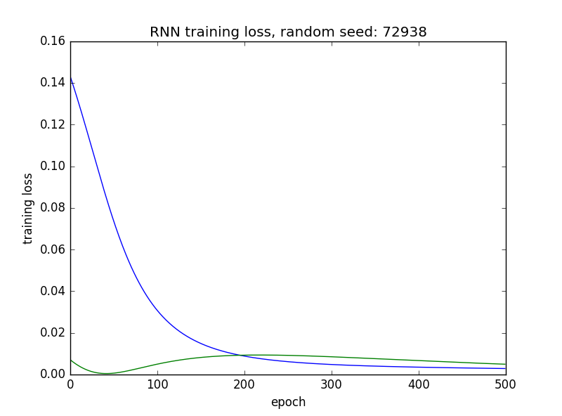
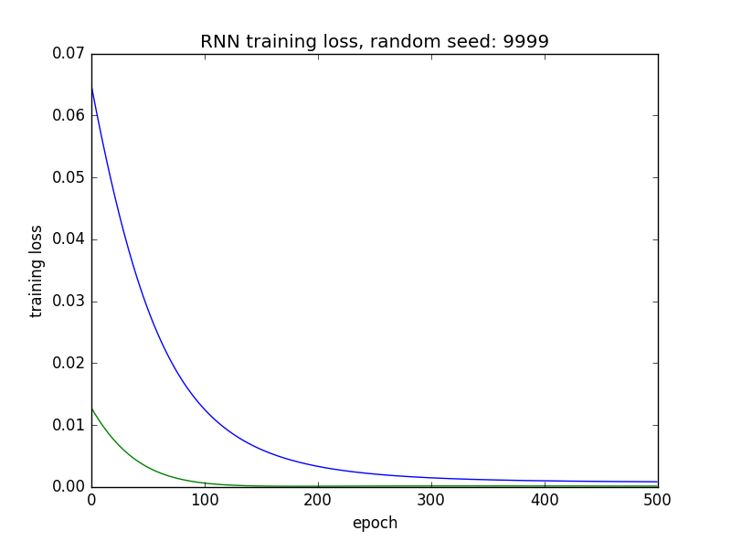
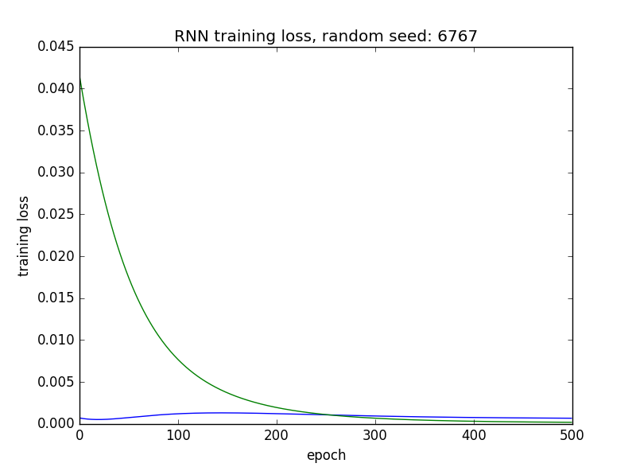
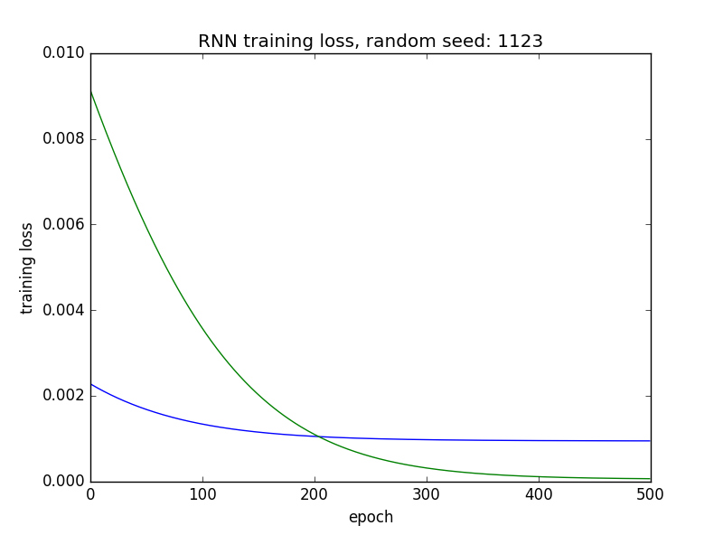
